<div align="center">


# Second Skool

### Run your whole tuition centre from one screen.

*Attendance · Results · Fees · Timetable · Rankings · Study material · Push notifications*

<p>


</p>

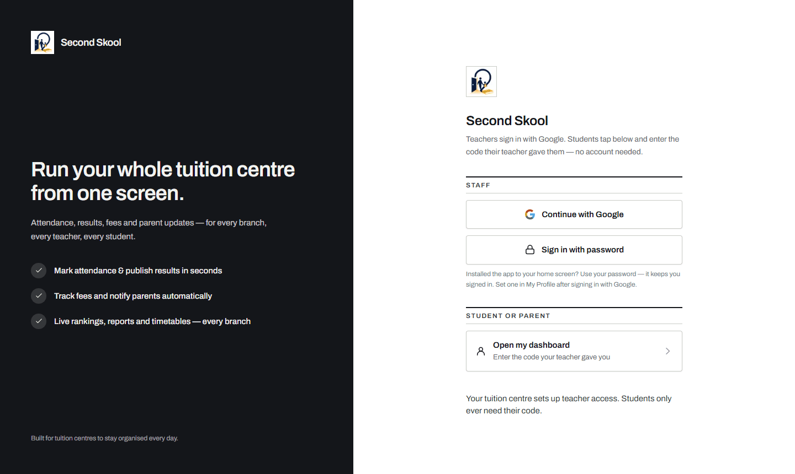

</div>

---

## 🎯 The problem

Most tuition centres in India still run on **WhatsApp groups, paper registers, and a fee diary**. Attendance gets lost. Parents ask "how is my child doing?" and nobody has a straight answer. Fees slip through the cracks.

**Second Skool replaces all of it with one app** — and every centre that signs up gets its own private, fully isolated space.

## 👥 Three apps in one

<table>
<tr>
<td width="33%" valign="top">

### 🏛️ Head
*The owner*

Creates the centre and runs it end to end — approves staff & students, manages branches, batches, subjects, fees, timetable, results, reports, and broadcasts.

</td>
<td width="33%" valign="top">

### 🧑‍🏫 Teacher
*The daily driver*

Takes attendance, enters results, sets homework, sends reminders, uploads notes and books parent meetings — on a phone, between classes.

Sees the timetable, the roster and every fee balance. Editing them, and anything to do with money or staff, stays with the head.

</td>
<td width="33%" valign="top">

### 🎓 Student
*No account needed*

Enters the private code their teacher gave them and instantly sees their attendance, marks, rank, fees, timetable and notes.

</td>
</tr>
</table>

## 📱 See it

<div align="center">

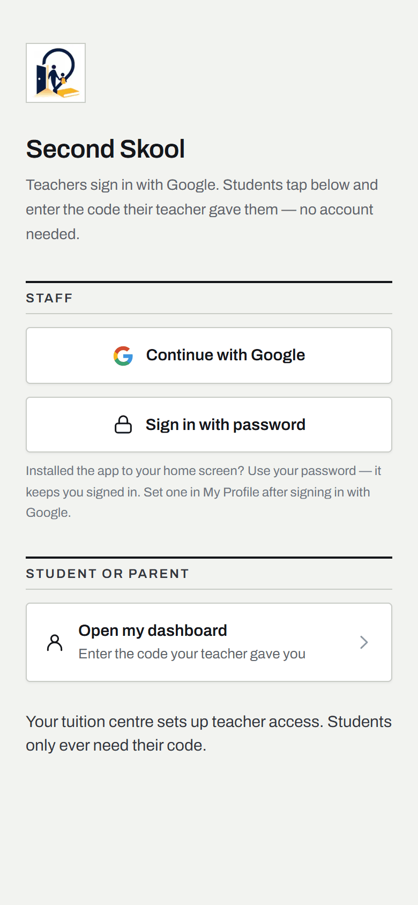
&nbsp;
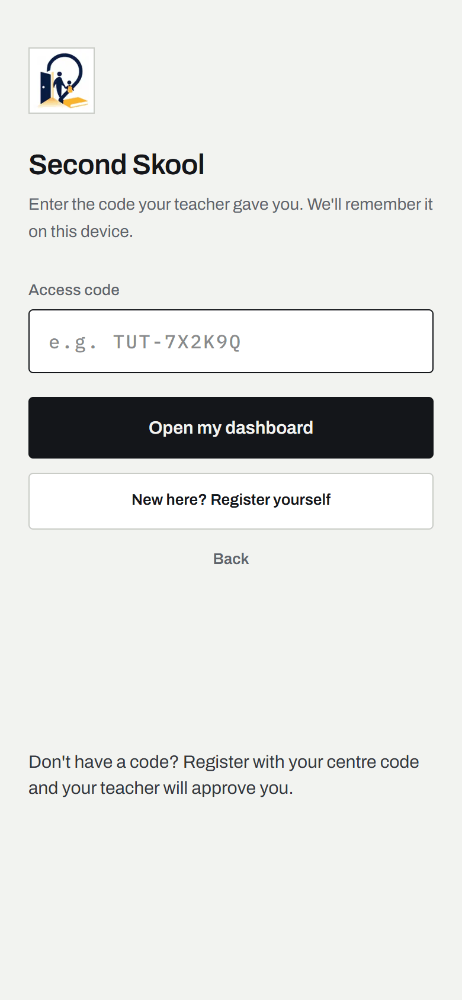
&nbsp;
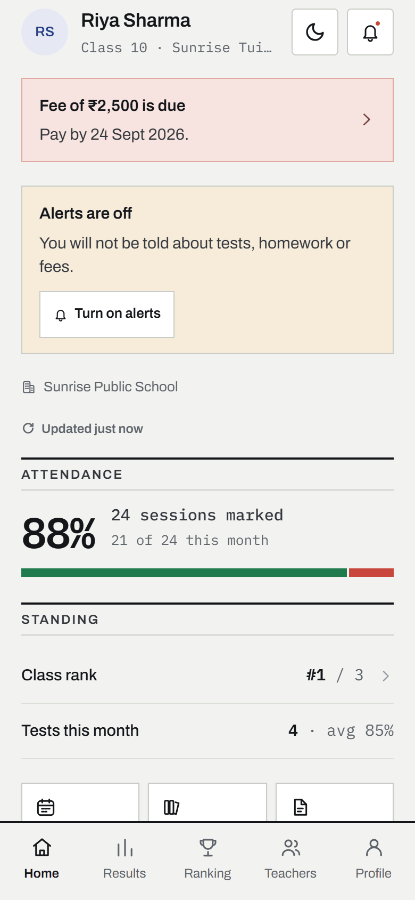

<sub>Sign in · Code entry · Dashboard home</sub>

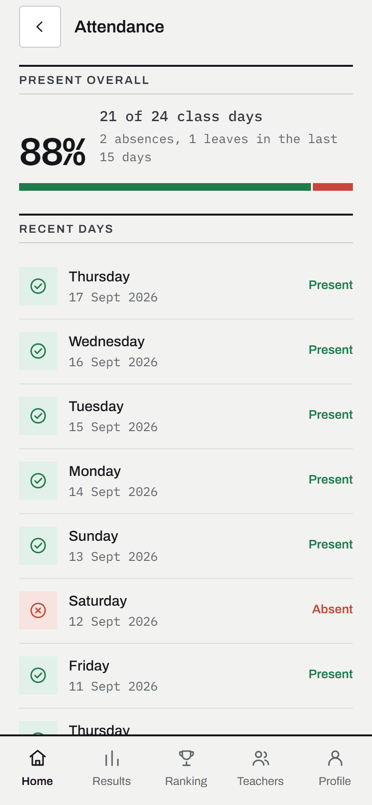
&nbsp;
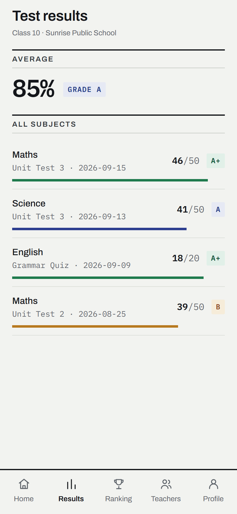
&nbsp;
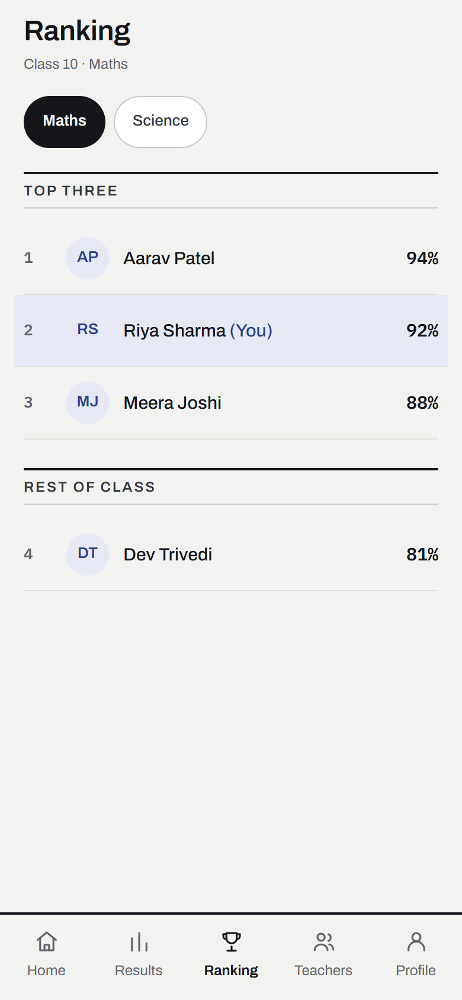

<sub>Attendance · Results · Ranking</sub>

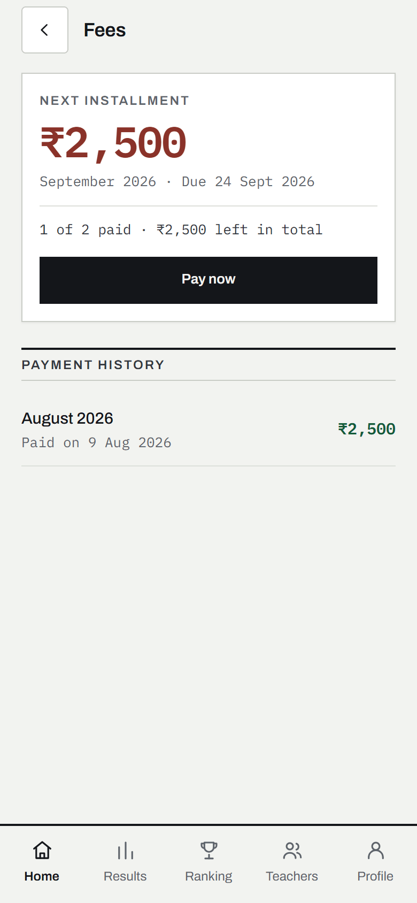
&nbsp;
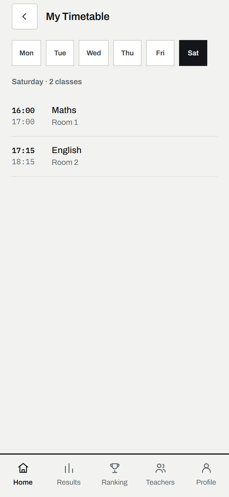

<sub>Fees · Timetable</sub>

<sub>What a parent sees after typing their child's code. Real app screens on a phone viewport, filled with sample data.</sub>

</div>

## ✨ What's inside

| | Feature | What it does |
|:--:|---|---|
| 📋 | **Attendance** | Per-batch daily attendance, student-visible history |
| 📊 | **Results & rankings** | Test marks, subject-wise rankings, student report cards |
| 💰 | **Fees** | Per-student records with a full breakdown — what each balance is actually made of. Head can add a fee, mark it paid, or remove one entered by mistake |
| 🗓️ | **Timetable** | Class and batch timetables for staff and students |
| 📝 | **Homework** | Set work per class with a due date; the class is notified |
| 🤝 | **Parent meetings** | Book a slot with a parent, reschedule it, or cancel it |
| 📚 | **Study material** | Upload and share notes & files (MIME-validated) |
| 📢 | **Reminders** | Send a notice to a class or one student — with a log of what has already gone out, so nobody gets chased twice |
| 🔔 | **Notifications** | Web push to the lock screen + in-app bell for heads, teachers and students |
| 🏢 | **Multi-branch** | Branches, subjects and batches per centre |
| ✅ | **Approvals** | Head approves staff and student join requests |
| 📈 | **Reports** | Centre-wide insight for the owner |
| 👁️ | **Parent visibility** | A parent enters their child's private code and sees attendance, marks, rank, fees, timetable and notes. No account, nothing to install, nothing the child can quietly leave out |
| 📲 | **Installs like an app** | Add to home screen, opens full screen, and every save says plainly whether it saved — no silent failures on a weak signal |

## 🏗️ How it's built

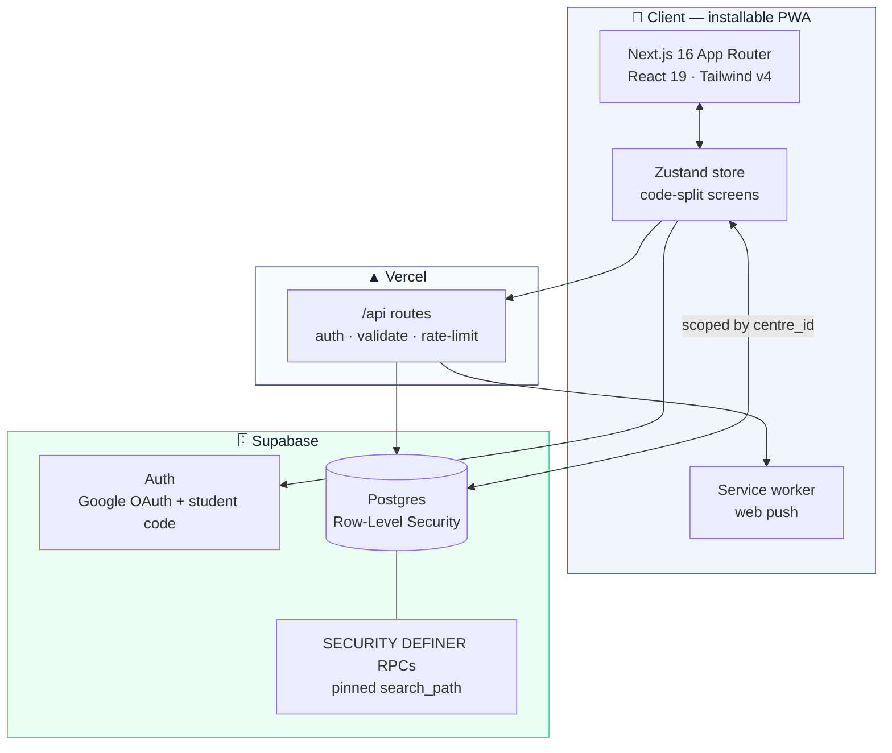

## 🔒 Multi-tenancy & security

Many centres share one deployment, so isolation is the whole ballgame. It's enforced **in the database, not in app code** — a compromised client still can't reach another centre's data.

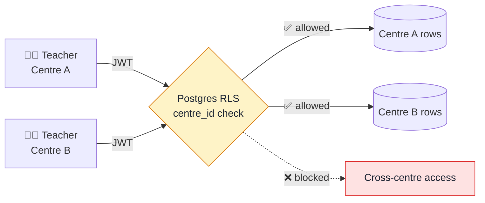

- **Row-Level Security** on every tenant table, keyed by `centre_id`.
- **Sensitive reads** go through `SECURITY DEFINER` RPCs with a pinned `search_path`; invalid student-code lookups are **rate-limited in the database** to blunt brute-force — while valid codes always resolve, so real students are never locked out.
- **Security headers** — CSP, HSTS, `X-Frame-Options`, `Referrer-Policy`, `Permissions-Policy` — in [`next.config.ts`](next.config.ts).
- **Every server route is validated and rate-limited** (shared across serverless instances via Upstash Redis when it is configured):
  - [`/api/push`](app/api/push/route.ts) authenticates the caller and scopes every send to their centre.
  - [`/api/push/student-request`](app/api/push/student-request/route.ts) tells the head a student is waiting. It has no session, so the new student code authorises the send, and it stops working once the request is approved or rejected.
  - [`/api/log`](app/api/log/route.ts) collects client crash reports, including from the sign-in screen, with a strict size and shape check.
  - [`/api/dev`](app/api/dev/route.ts) is the operator console. It is gated to an allow-listed, confirmed Google identity, and it is the only place the service-role key is used for reads across centres.
- **Notification links** are relative-only, so a tapped notification can never redirect off-app.
- **Structured logging** is PII-safe by construction — the type system rejects dumping whole records into a log line.

## 📘 User guides

Printable PDF handouts for the people who actually use the app, drawn in the app's current look.

| Guide | For | What's in it |
|---|---|---|
| **How-To Guide** | Heads, teachers, parents | Step-by-step, no jargon. Start here. |
| **Complete Feature Guide** | Heads and teachers | Every feature, role by role, with phone screens. |
| **Parent Guide** | Parents | Signing in with the child's code and reading each tab. |

The PDFs are generated, not committed. Build the one you need:

```bash
pip install reportlab
python scripts/pdf/howto.py     # Second-Skool-How-To-Guide.pdf
python scripts/pdf/guide.py     # Second-Skool-Complete-Feature-Guide.pdf
python scripts/pdf/parents.py   # Second-Skool-Parent-Guide.pdf
```

They land in the repo root. See [`scripts/pdf/README.md`](scripts/pdf/README.md) before editing one.

## 🚀 Quick start

> Requires **Node 20.9+** (CI runs 24) and a Supabase project.

```bash
# 1 — install
npm install

# 2 — configure
cp .env.example .env.local        # then fill it in

# 3 — database
#     Run supabase/migrations/*.sql in numeric order, starting with
#     0000_schema_migrations.sql. See supabase/README.md.

# 4 — push keys
npx web-push generate-vapid-keys  # paste into .env.local

# 5 — go
npm run dev                       # → http://localhost:3000
```

## 🧰 Scripts

| Command | What it does |
|---|---|
| `npm run dev` | Dev server (Turbopack) |
| `npm run build` | Production build |
| `npm start` | Serve the production build |
| `npm run lint` | ESLint |
| `npm test` | Vitest suite |

## ⚙️ Configuration

Full list in [`.env.example`](.env.example).

| Variable | Required | Purpose |
|---|:--:|---|
| `NEXT_PUBLIC_SUPABASE_URL` / `..._ANON_KEY` | ✅ | Client connection |
| `SUPABASE_SERVICE_ROLE_KEY` | ✅ | Server-only, used by the `/api/*` routes. Never prefix it `NEXT_PUBLIC_` |
| `VAPID_*` / `NEXT_PUBLIC_VAPID_PUBLIC_KEY` | ✅ | Web push |
| `NEXT_PUBLIC_SITE_URL` | ➖ | Absolute base for OG images & manifest |

<sub>Optional vars are **dormant when unset** — the app runs fine without them and upgrades itself the moment they're added.</sub>

## 📦 Deployment

Deploys to **Vercel** with zero config. Add the environment variables to the Vercel project (Production **and** Preview), point it at your production Supabase, and attach a domain.

---

<div align="center">
<sub>Built for coaching classes and tuition centres. 🇮🇳</sub>
</div>
